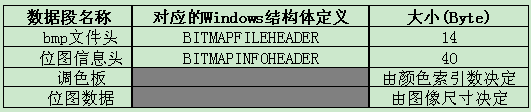
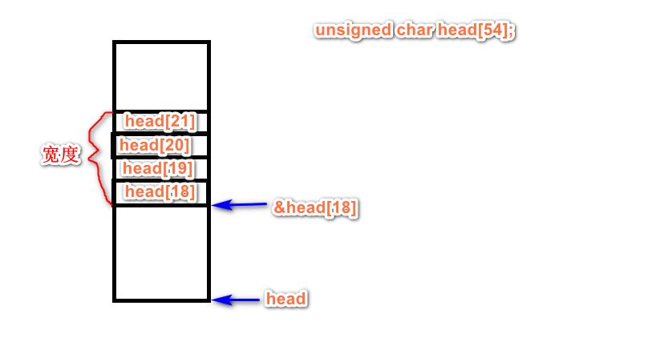
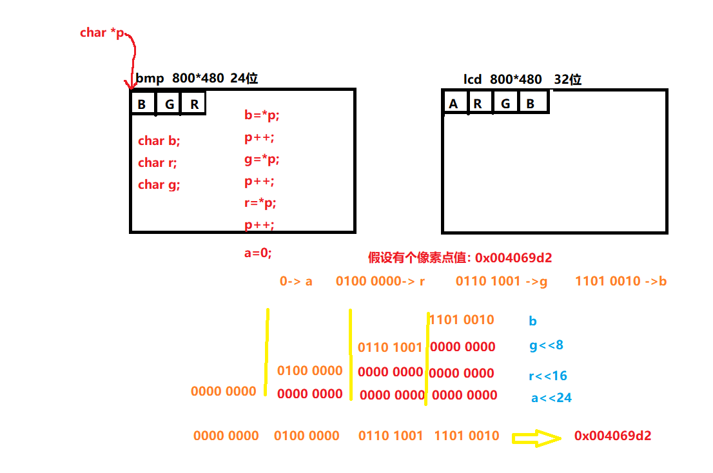
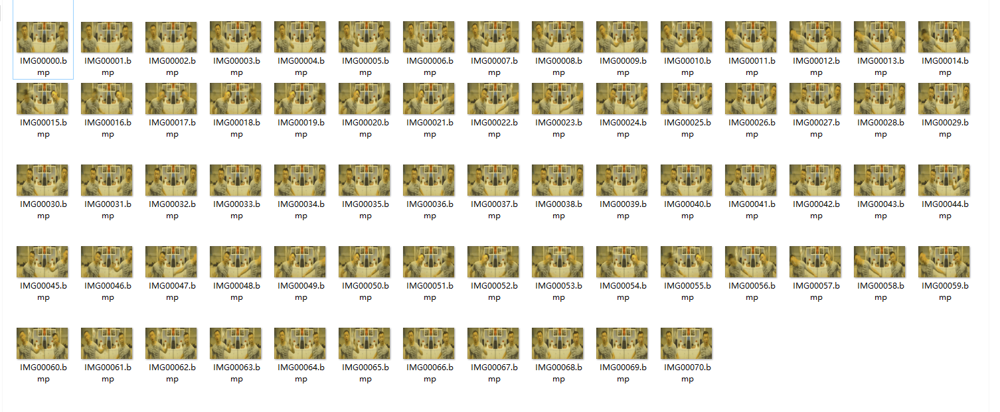

# zhku-electronic-design
# Description
电子类大三的课程设计  

> 校企合作的粤嵌开发板，顺便吐槽一句,这个讲师跟培训班的一样..
__嗯。。有个女老师挺好看的！！好喜欢!!__

## Requirement
> 我用的是vscode加老师发的环境，等以后有机会想自己配置。。
* arm-none-linux-gnueabi-4.5.1
* ubuntu-12.04


## Contributor
__电子181余杰聪__
## Maintainer
__电子181余杰聪__

## Content

## 第一周
### 0.写在前头的一些心得
```
#include<math.h>//在arm-linux-gcc时要加上-lm参数才能通过
#include<pthread.h>要加 -phread参数

插入优盘后来到/mnt/udisk查看数据，若没有，需要mount挂载但我暂时不知道怎么解决这个问题。
```
### 1.学习使用文件操作写入屏幕(screen.c)
 * /dev/fb0是屏幕文件，可以写入数据操控显示
 * 一个像素是由ARGB格式组成，所以要写入32个字节，在最后write时记得WIDTH×HEIGHT×4
 * 常用头文件以及函数原型
 ```
  #include<fcntl.h>//open
  #include<unistd.h>// write lseek read close
  #include<sys/mman.h>//mmap munmap
  
  //open
  int open(const  char *pathname,int flags);
  int open(const char *pathname,int flags,mode_t mode)
  
  //write
  ssize_t write(int fd,const void *buf,size_t count);
  
  //close
  int close（int fd）;
  
  //lseek
  off_t lseek(int  fd,off_t offset,int whence);
  
  //read
  ssize_t  read(int fd,void  *buffer,size_t count);
  
  //mmap 
  void* mmap(void* start,size_t length,int prot,int flags,int fd,off_t offset);
  
  //munmap
  int munmap(void* start,size_t length);
  
 ```
 * _mmap比较复杂，下面是一些补充_
  start：映射区的开始地址，设置为0时表示由系统决定映射区的起始地址。
  length：映射区的长度。//长度单位是 以字节为单位，不足一内存页按一内存页处理
  
  mmap的prot(期望的内存保护标志)常用的宏
  ```
  PROT_READ //页内容可以被读取
  PROT_WRITE //页可以被写入
  ```
  
  flags：指定映射对象的类型，映射选项和映射页是否可以共享。它的值可以是一个或者多个以下位的组合体
  ```
  MAP_SHARED //与其它所有映射这个对象的进程共享映射空间。对共享区的写入，相当于输出到文件。直到msync()或者munmap()被调用，文件实际上不会被更新。
  ```
 
 > _[mmap只是在虚拟内存分配了地址空间，只有在第一次访问虚拟内存的时候才分配物理内存。](https://www.jianshu.com/p/755338d11865)_
 
 > _[总而言之，常规文件操作需要从磁盘到页缓存再到用户主存的两次数据拷贝。而mmap操控文件，只需要从磁盘到用户主存的一次数据拷贝过程。说白了，mmap的关键点是实现了用户空间和内核空间的数据直接交互而省去了空间不同数据不通的繁琐过程。因此mmap效率更高](https://blog.csdn.net/qq_33611327/article/details/81738195)_
 
### 2.读取bmp图片(showbmp.c)
 * __只能读取<800*480分辨率的图片，否则就会出现segmentation fault！！因为是数组越界了__
 
 [1.bmp简单的介绍](https://blog.csdn.net/nicholas_duan/article/details/90717599)


__图文件从文件头开始偏移54个字节就是位图数据了__

```
//bmpfd信息
int bmpfd=open("mn.bmp",O_RDONLY);
//读取bmp头部信息
unsigned char bmpHead[54]={'0'};
read(bmpfd,bmpHead,sizeof(bmpHead));
```
_所以我们需要首先读取54个字节来获取相关的详细数据包括高度和宽度,再读取bmp的像素数据，分别是宽度为18到22和22到26这对应的4个字节储存宽和高_
_这也是强制转换的一种用法，将char类型转成int时会强制读4个字节的数据即可_

```     
int bmpHeight=*((int *)&bmpHead[22]);
int bmpWidth=*((int *)&bmpHead[18]);
printf("bmpHeight=%d,bmpWidth=%d \n",bmpHeight,bmpWidth);
```
_声明bmp像素数据数组，以及我们对应的屏幕像素数组_
```
//屏幕像素信息
int screenPixels[bmpHeight][bmpWidth];
//只能读取小于480*800的bmp图片！
char bmpPixels[WIDTH*HEIGHT*3];
//读取bmp像素数据
read(bmpfd,bmpPixels,sizeof(bmpPixels));
```
* 2.bmp格式转换
_bmp中一个像素是元祖(B,G,R)组成的,而开发板的像素是由(A,R,G,B)组成的，这里有一种算法能够转换_
_由于R,G,B,A都是1字节数据，我们用char类型接收它，后来再用int类型转换到4字节_
```
unsigned char r,g,b,a,*bmpPixelsPointer=bmpPixels;
unsigned int color=0;
unsigned int x=0,y=0;
```
_这里比较复杂，但其实不难理解，利用了一些位操作和左移的结合比较巧妙，但很难想出来_


大意就是将(B,G,R)各个像素元素提取出来然后通过左移让他们分别增大0位，8位，16位，A就左移24位。再根据或操作1与0得1得到最后合成的（A,R,G,B）值
```
        for(y=0;y<bmpHeight;y++)
        {
                for(x=0;x<bmpWidth;x++){
                        b=*bmpPixelsPointer++;
                        g=*bmpPixelsPointer++;
                        r=*bmpPixelsPointer++;
                        a=0;
                        color=a<<24 |r<<16|g<<8|b;
                        screenPixels[y][x]=color;
                        *(screenMap+y*800+x)=screenPixels[y][x];
                }
        };
```
* 3.end
__最后别忘记关掉文件释放内存哦__
```
        close(screen);
        close(bmpfd);
        munmap(screenMap,HEIGHT*WIDTH*4);
```
* 4.动图bmp实现(gif.c)__(补充)__
_这也是挺简单的思路，将show_bmp封装成一个函数，再传入path即可_
_不过bmp占的内存太大了，800*480就要1M左右，实现一个gif要70M就离谱_
  

__动图是这样的__
  

_简单一点的做法是这样的，通过对ASCII的巧妙运用以及C语言中int和char的联系(gif2.c)_
```
    while (1){
        //从ASCII的48='0'开始
        for(index=48;index<56;index++){
            path[6]=(char )index;
            for(j=48;j<58;j++)
            {
                path[7]=(char )j;
                //printf("path=%s\n",path);
                show(path,screen,screenMap);
                //赋值
                delay(0.5);
                
            }

        }
    }
```

__[C语言里整数转字符串比较麻烦，自己写的话估计就要好久，所以百度哈哈，这是一个不难也不简单的算法](https://blog.csdn.net/nanfeibuyi/article/details/80811498)__  

主要逻辑是这样的,__但是不推荐使用这种方法,这里只是稍微介绍一下有这种方式处理！！详细请去看（gif.c）__
```
    char path[]="IMG00000.bmp";
    int index,j,k;
    char a[1],b[1];
    int screen=open("/dev/fb0",O_RDWR);
    int *screenMap=mmap(NULL,HEIGHT*WIDTH*4,PROT_READ | PROT_WRITE,MAP_SHARED,screen,0);
    while (1){
        for(index=0;index<8;index++){
            for(j=0;j<10;j++)
            {
                if(index==7 && j==6){
                    break;
                }
                path[6]=*Int2String(index,a);
                path[7]=*Int2String(j,b);
                //printf("path=%s\n",path);
                show(path,screen,screenMap);
                //赋值
                delay(1);
            }
        }
    }
```
## 第二周
### 0.线程调用
pass
### 1.学习操控触摸板(input.c)(待定)
 * 输入设备事件类型常用宏
 ```
         /*
        EV_SYN 0x00     同步事件
        EV_KEY 0x01     按键事件
        EV_REL 0x02     相对坐标
        EV_ABS 0x03     绝对坐标
        EV_MSC 0x04     其它
        EV_LED 0x11     LED
        EV_SND 0x12     声音
        EV_REP 0x14     连击
        EV_FF  0x15     力反馈 
        EV_PWR 0x16     电源
        EV_FF_STATUS    状态
        */
 ```
 * 常用头文件
 ```
 #include<linux/input.h>
 ```
